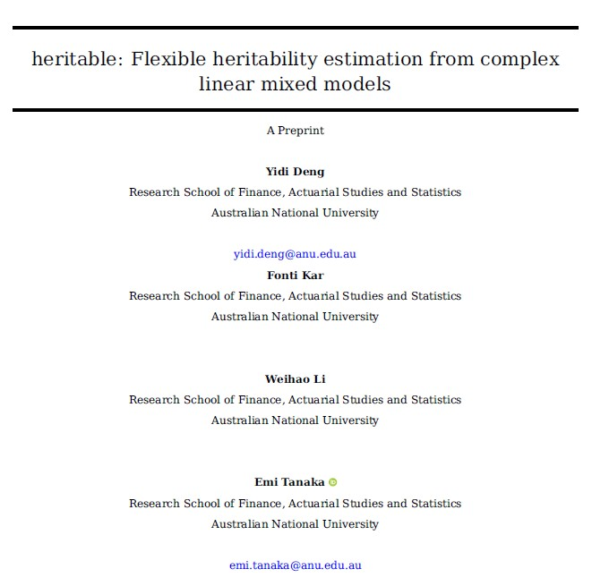

## Project overview

### Flexible heritability estimation for linear mixed models (LMMs)

This project aims to make heritability estimation from LMMs more accessible, flexible, and interpretable.

<br>

### It brings together:

-   6 commonly used heritability estimators [@schmidt_2019]
-   confidence interval based on parametric bootstrap
-   support for different LMM fitters, including `asreml` and `lme4`, with flexible model constructs
-   G×E extensions for environment-specific and environment-averaged heritability
-   a companion paper on estimator relationships and statistical properties

## Acknowledgement

<br><br>

{fig-align="center" .circle-photo}

<br><br>

**Dr. Fonti Kar** made the foundational contribution to this project.

## Software availability

### Thanks to Fonti’s earlier work, **`heritable` is already available on CRAN**.

The CRAN version only supports **broad-sense heritability** estimation on relatively simple model.

<br>

::: {.small-code}
```{r}
#| echo: true
#| eval: true

# # Install the CRAN version
# install.packages("heritable")

fit <- lme4::lmer(y ~ rep + (1|gen), data = heritable::lettuce_phenotypes)

heritable::H2(fit, target = "gen")
```
:::

<br>

The current development version is maintained on GitHub, mainly on the **`narrow-sense`** branch (<https://github.com/anu-aagi/heritable/tree/narrow-sense>).

## Manuscript in preparation


:::: {.columns}

::: {.column width="35%"}
<br><br>

{fig-align="center"}
:::

::: {.column width="65%"}
<br>

### Beyond implementing existing estimators

We re-derive different heritability estimators within **a unified mathematical framework** that:

- connects different estimators

- provides a comprehensive understanding of their underlying estimands

- extends heritability definitions to more flexible model settings

<br>

Extensive numerical studies show that heritability estimation is strongly **design-dependent**.
:::

::::

## Heritability as variance partitioning

### Heritability estimation is fundamentally about *partitioning variation* under a LMM.

$$
\mathbf{y}
=
\mathbf{X}\boldsymbol{\beta}
+
\mathbf{Z}_g\mathbf{u}_g
+
\mathbf{Z}_{ge}\mathbf{u}_{ge}
+
\boldsymbol{\varepsilon}
$$

where

$$
\mathbf{u}_g \sim N(\mathbf{0}, \mathbf{G}_g),
\qquad
\mathbf{u}_{ge} \sim N(\mathbf{0}, \mathbf{G}_{ge}),
\qquad
\boldsymbol{\varepsilon} \sim N(\mathbf{0}, \mathbf{R})
$$

This model gives arise to three related variance quantities:

- Phenotypic variance: $V_P = \mathrm{Var}(\mathbf{d}^\top \mathbf{y})$

- Genetic variance: $V_G = \mathrm{Var}(\mathbf{c}^\top \mathbf{u}_g)$

- Prediction error variance: $V_{\mathrm{PEV}} =\mathrm{Var}\left[\mathbf{c}^\top\left(\mathbf{u}_g - \hat{\mathbf{u}}_g\right)\right]$, $\hat{\mathbf{u}}_g$ is the BLUP of $\mathbf{u}_g$

## Two classes of heritability estimators

Two classes of estimators emerge from decomposing two different notions of variance:

<br>


### Phenotypic variance partition
$$
V_P = \mathrm{Var}(\mathbf{d}^\top \mathbf{y}) =
\underbrace{\mathrm{Var}(\mathbf{d}^\top \mathbf{Z}_g\mathbf{u}_g)}_{V_G} + 
\mathrm{Var}(\mathbf{d}^\top \mathbf{Z}_{ge} \mathbf{u}_{ge}) +  
\mathrm{Var}(\mathbf{d}^\top \mathbf{\epsilon})
$$
$$
H^2 = V_G/V_P
$$

### Genetic variance partition
$$
V_G = \mathrm{Var}(\mathbf{c}^\top \mathbf{u}_g) =\mathrm{Var}(\mathbf{c}^\top \hat{\mathbf{u}}_g) + \underbrace{\mathrm{Var}\left[\mathbf{c}^\top\left(\mathbf{u}_g - \hat{\mathbf{u}}_g\right)\right]}_{V_{\text{PEV}}}
$$
$$
H^2 = 1 - V_{\text{PEV}}/V_G
$$

## Phenotypic variance partition

This class includes the `Standard`, `Delta (BLUE)`, and `Piepho` estimators. Different estimator differs by how the linear functionals are defined:

- `Standard` [@falconer1996introduction]: $\mathbf{d}_{ij}$ is defined for a genotype pair $(i, j)$ such that $\mathbf{d}_{ij}^\top \mathbf{y}$ represents the phenotypic mean difference between genotypes $i$ and $j$:
  $$
  \mathbf{d}_{ij}^\top \mathbf{y} = \bar{y}_i - \bar{y}_j. 
  $$
- `Delta (BLUE)` [@schmidt2019estimating]: same pairwise idea, but $\mathbf{d}_{ij}$ maps $\mathbf{y}$ to BLUE contrasts from a counterpart model where genetic effects are fitted as fixed:
  $$
  y \sim x + (1|g) + (1|ge) \Rightarrow y \sim x + g + (1|ge)
  $$
  $$
  \mathbf{d}_{ij}^\top \mathbf{y}
  =
  \hat{\beta}_{g_i} - \hat{\beta}_{g_j}.
  $$

- `Piepho` [@piepho2007computing]: aggregated $\Delta^{\text{BLUE}}$ heritability for isotropic $\mathbf{G}_g$

## Genetic variance partition

Similarly, the `Delta (BLUP)`, `Cullis`, and `Oakey` estimators differ in how they define linear functionals of genetic effects. 

- `Delta (BLUP)` [@schmidt2019estimating]: $\mathbf{c}_{ij}$ is defined for genotype pair $(i, j)$ for genetic effect contrast:
  $$
  \mathbf{c}_{ij}^\top\mathbf{u}_g = u_{g_i} - u_{g_j}
  $$

- `Cullis` [@cullis2006design]: aggregated $\Delta^{\text{BLUP}}$ heritability for isotropic $\mathbf{G}_g$

- `Oakey` [@oakey2006joint]: $\mathbf{c}$ is defined in a model dependent way to maximize heritability:
  $$
  \arg\max_\mathbf{c} 1- \frac{\mathrm{Var}\left[\mathbf{c}^\top\left(\mathbf{u}_g - \hat{\mathbf{u}}_g\right)\right]}{\mathrm{Var}(\mathbf{c}^\top \mathbf{u}_g)}
  $$

## We can define our own linear functionals

The calculation follows the same principle as long as the genetic effect of interest can be isolated as a random effect component.

<br>

$$
\mathbf{y}
=
\mathbf{X}\boldsymbol{\beta}
+
\color{red}{\mathbf{Z}_g\mathbf{u}_g}
\color{black}
+
\mathbf{Z}_{ge}\mathbf{u}_{ge}
+
\boldsymbol{\varepsilon}
$$

## Extension to G×E is straightforward

G×E effects can be incorporated into the heritability definition by defining and decomposing variance of the full random effect vector
$$
\mathbf{u} = \begin{bmatrix} \mathbf{u}_g \\ \mathbf{u}_{ge} \end{bmatrix},
$$
Let $\tilde{\mathbf{c}}$ be a linear functional defined on $\mathbf{u}$, then 
$$
H^2_{\text{GVP}} = 1 - \frac{V_{\text{PEV}}}{V_G} = 1- \frac{\mathrm{Var}\left[\tilde{\mathbf{c}}^\top\left(\mathbf{u} - \hat{\mathbf{u}}\right)\right]}{\mathrm{Var}(\tilde{\mathbf{c}}^\top \mathbf{u})}.
$$

This extension can be applied also to phenotypic variance partitioning. 

## Stratified and marginal heritability

### Stratified heritability

We can define stratified heritability with a functional $\tilde{\mathbf{c}}_{ijk}$ that contrasts genetic effects within an environment $k$, such that 
$$
\tilde{\mathbf{c}}_{ijk}^\top\mathbf{u} = u_{g_i} + u_{ge_{ik}} - (u_{g_j} + u_{ge_{jk}})
$$

### Marginal heritability
We can also define marginal heritability by $\tilde{\mathbf{c}}_{ij}$ that contrasts genetic effects averaged across environments, such that
$$
\tilde{\mathbf{c}}_{ij}^\top\mathbf{u} = \left( u_{g_i} + \sum_k \mathbb{E}[z_{ge_{ik}}] u_{ge_{ik}} \right) - \left(u_{g_j} + \sum_k \mathbb{E}[z_{ge_{jk}}] u_{ge_{jk}} \right) 
$$

## Usage

There are three important arguments for the key functions `H2` and `h2`:

- `target`: specifying the model component on which heritability is estimated

- `marginal`: whether to compute marginal heritability

- `stratification`: specifying the environmental strata at which heritability is estimated

<br>

We use a lettuce breeding dataset for resistance to downy mildew for demonstration [@hadasch2016comparing]

<br>

::: {.small-code}
```{r}
#| echo: true
#| eval: true
# gen: genotype
# loc: location
# rep: replicates
# Fit a asreml model
model <- asreml::asreml(
  fixed = y ~ rep,
  random = ~ gen + loc + gen:loc,
  trace = FALSE, data = heritable::lettuce_phenotypes)
```
:::

## Board-sense heritability

### Main heritability

::: {.small-code}
```{r}
#| echo: true
#| eval: true
heritable::H2(model, target = "gen", marginal = FALSE)
```
:::

<br>

### Marginal heritability

::: {.small-code}
```{r}
#| echo: true
#| eval: true
heritable::H2(model, target = "gen", marginal = TRUE)
```
:::

<br>

### Stratified heritability at location `L1`

::: {.small-code}
```{r}
#| echo: true
#| eval: true
heritable::H2(model, target = "gen", stratification = data.frame(loc = "L1"))
```
:::

## Narrow-sense heritability

### Same usage, differs in the modelling stage

We model known additive genetic variance structure using the `vm` special in `asreml`:

<br>

::: {.small-code}
```{r}
#| echo: true
#| eval: true
# lettuce_GRM: genomic relationship matrix defining the known variance structure
# Fit a asreml model
model <- asreml::asreml(
  fixed = y ~ rep,
  random = ~ vm(gen, source = heritable::lettuce_GRM)*idv(loc),
  trace = FALSE, data = heritable::lettuce_phenotypes)
```
:::

<br>

An additional argument `source` is required by `h2`: 

<br>

::: {.small-code}
```{r}
#| echo: true
#| eval: true
heritable::h2(model, target = "gen", marginal = FALSE,
              source = list(`heritable::lettuce_GRM` = heritable::lettuce_GRM))
```
:::

## Confidence Interval

To compute CI, simply run `confint` on saved `heritable` objects

<br>

```{r}
ci_tab <- readRDS("code/ci_tab.rds")
```

::: {.small-code}
```{r}
#| echo: true
#| eval: false
# Store the `heritable` object
my_h2 <- heritable::h2(model, target = "gen", marginal = FALSE,
              source = list(`heritable::lettuce_GRM` = heritable::lettuce_GRM))

# Run confint generic!
confint(my_h2, parallel = "snow", ncpus = 3)
```
```{r}
ci_tab
```
:::

<br>

The function supports parallel computing to accelerate parametric bootstrap.

## Works for complex models

### Deep nesting

```{r}
my_H2 <- readRDS("code/H21.rds")
```

::: {.small-code}
```{r}
#| echo: true
#| eval: false
lme4::lmer(
  y ~ Type * Treatment * Stage +
    (1 | Genotype) + (Stage | Genotype / Treatment) +
    (1 | Date) + (1 | Plot / Replicate),
  data = df,
  REML = FALSE
) |>
  heritable::H2(target = "genotype")
```
```{r}
my_H2
```
:::

<br>

### Residual modeling

```{r}
my_H2 <- readRDS("code/H22.rds")
```

::: {.small-code}
```{r}
#| echo: true
#| eval: false
asreml(
  fixed = y ~ 1,
  random = ~ Line + Range + Row + RowRep:ColRep,
  residual = ar1(Range):ar1(Row),
  data = df
) |>
  heritable::H2(target = "Line")
```
```{r}
my_H2
```
:::

## Future development

### More variance structures

`heritable` needs to parse `asreml` variance modeling specials and convert variance estimates into variance matrices.

- Some structures are already supported

- More structures can be added

### Custom heritability definitions

Future versions could allow users to provide their own linear functionals, such as $\mathbf{d}$ or $\mathbf{c}$.

This would support custom heritability definitions for user-defined contrasts.

## Reference

::: {#refs}
:::
